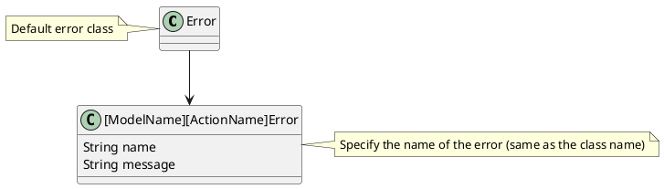

# Engine Errors

Used to provide meanfull error messages and simplify catch and throw for errors.

Error class should be created for models:
- Annotation
- Comment
- View
- ...

for action:
- Annotation create
- Annotation update
- Comment create
- View create
...

## Creation



## Usage

Fragile methods that produce output should return expected value only.
Return values like `null` or `void` should be **avoided**.

~~`async createAnnotationAction (...): Promise<Annotation | void>`~~
`async createAnnotationAction (...): Promise<Annotation>`

Instead, we should throw an error (related to the model and action) or reject promises.
To handle at a higher level.

```javascript
// method declaration
  public async createAnnotationAction (...): Promise<Annotation> {
    ...
    const annotation = await this.prepareAnnotationForCreation(params, subAnnotationParams)
    if (!annotation) { throw new AnnotationCreationError() }
    ...
  }
```

```typescript
// method usage
  try {
    await methodsClass
      .createAnnotationAction(params)
  } catch (e: unknown) {
    // Handle error
    console.error(e) // Get us some info about the error
  }
```
